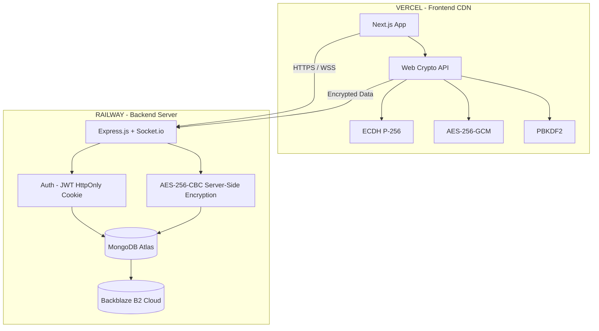
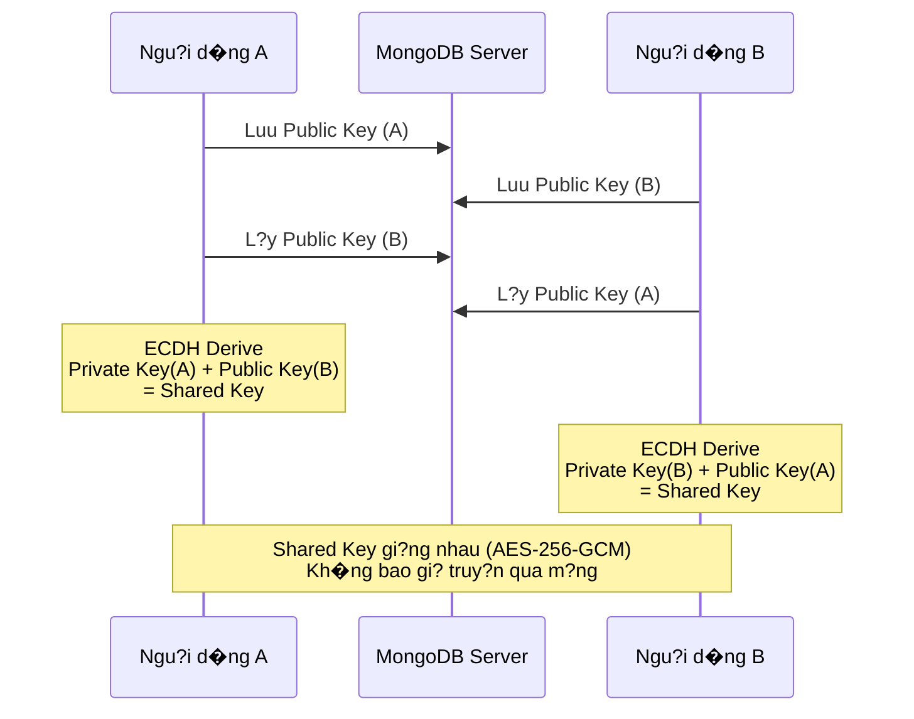
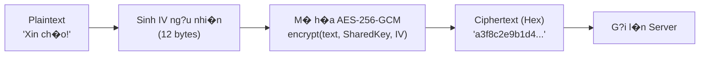
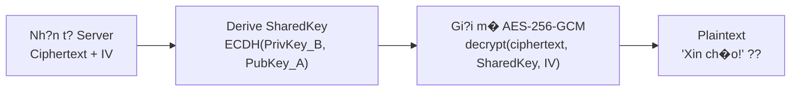
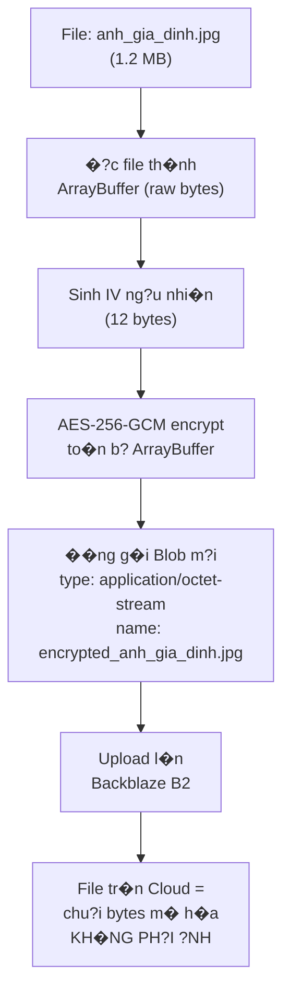
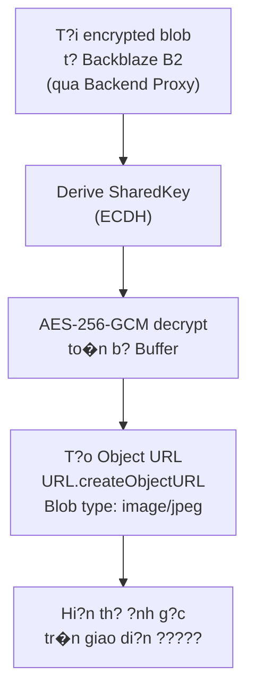
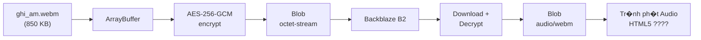
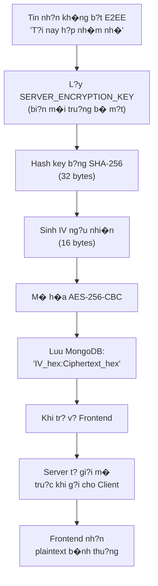
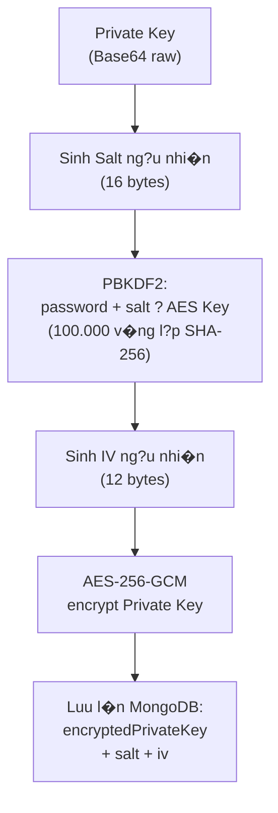
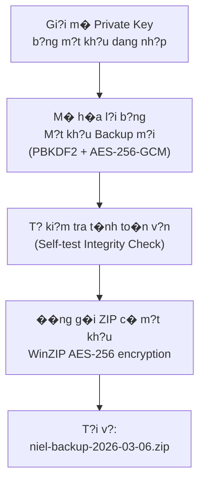

# Nghi�n c?u Khoa h?c: Niel � H? th?ng Nh?n tin B?o m?t M� h�a �?u cu?i (E2EE)

## 1. T?ng quan �? t�i (Abstract)

**T�n d? t�i:** Nghi�n c?u v� x�y d?ng ?ng d?ng nh?n tin b?o m?t Niel t�ch h?p m� h�a d?u cu?i (End-to-End Encryption).

**M?c ti�u nghi�n c?u:** Thi?t k?, tri?n khai v� d�nh gi� m?t h? th?ng li�n l?c th?i gian th?c (Real-time Messaging) da n?n t?ng (Web/Mobile Web), trong d� quy?n ri�ng tu v� t�nh b?o m?t d? li?u du?c d?t ? m?c t?i da th�ng qua m� h�nh **Zero-Knowledge Architecture** � nghia l� ngay c? nh� v?n h�nh h? th?ng cung kh�ng th? d?c du?c n?i dung tin nh?n hay c�c t?p d�nh k�m c?a ngu?i d�ng.

**B�i to�n d?t ra:** Ph?n l?n c�c ?ng d?ng nh?n tin ph? bi?n hi?n nay v?n luu tr? tin nh?n ? d?ng van b?n r� (plaintext) ho?c ch? m� h�a tr�n du?ng truy?n (TLS/SSL), d?n d?n nguy co l? l?t th�ng tin nghi�m tr?ng n?u co s? d? li?u b? t?n c�ng (Data Breach). �? t�i n�y nghi�n c?u gi?i ph�p m� h�a da t?ng (multi-layer encryption) cho to�n b? c�c lo?i d? li?u: van b?n, h�nh ?nh, t?p d�nh k�m v� ghi �m.

---

## 2. Ki?n tr�c H? th?ng (System Architecture)

H? th?ng du?c x�y d?ng tr�n ki?n tr�c **Client-Server** hi?n d?i, t�ch bi?t ho�n to�n Frontend v� Backend, tri?n khai tr�n h? t?ng d�m m�y:

### 2.1. Frontend (Ph�a M�y kh�ch)

<table>
<tr><th>Th�nh ph?n</th><th>C�ng ngh?</th><th>Vai tr�</th></tr>
<tr><td>Framework</td><td>Next.js (React) + TypeScript</td><td>X�y d?ng giao di?n ngu?i d�ng SPA</td></tr>
<tr><td>Styling</td><td>Tailwind CSS</td><td>Responsive Mobile-first Layout</td></tr>
<tr><td>Hosting</td><td>Vercel</td><td>CDN ph�n ph?i to�n c?u</td></tr>
<tr><td>State Management</td><td>React Context API + Custom Hooks</td><td>Qu?n l� tr?ng th�i ?ng d?ng</td></tr>
<tr><td>M?t m� h�a</td><td><b>Web Crypto API</b> (tr�nh duy?t native)</td><td>Th?c thi to�n b? thu?t to�n m� h�a ph�a client</td></tr>
<tr><td>�a ng�n ng?</td><td>next-intl (i18n)</td><td>Giao di?n Ti?ng Vi?t / Ti?ng Anh</td></tr>
</table>

### 2.2. Backend (Ph�a M�y ch?)

<table>
<tr><th>Th�nh ph?n</th><th>C�ng ngh?</th><th>Vai tr�</th></tr>
<tr><td>Framework</td><td>Node.js + Express.js</td><td>RESTful API Server</td></tr>
<tr><td>Real-time</td><td>Socket.io</td><td>Truy?n t?i tin nh?n hai chi?u th?i gian th?c</td></tr>
<tr><td>Database</td><td>MongoDB Atlas (Mongoose ODM)</td><td>Luu tr? d? li?u NoSQL</td></tr>
<tr><td>Object Storage</td><td>Backblaze B2 Cloud</td><td>Luu tr? file/?nh d� m� h�a</td></tr>
<tr><td>Hosting</td><td>Railway</td><td>Deploy Backend + WebSocket</td></tr>
<tr><td>X�c th?c</td><td>JWT + HttpOnly Cookie</td><td>Qu?n l� phi�n dang nh?p an to�n</td></tr>
</table>

### 2.3. M� h�nh Ki?n tr�c Tri?n khai



---

## 3. H? th?ng M� h�a � Tr?ng t�m Nghi�n c?u (Encryption System)

��y l� **tr?ng t�m c?t l�i** c?a nghi�n c?u. H? th?ng tri?n khai m� h�nh **m� h�a da t?ng** (Multi-layer Encryption) v?i 3 l?p b?o v? ch?ng nhau.

### 3.1. L?p 1 � M� h�a �?u cu?i E2EE (End-to-End Encryption)

#### 3.1.1. Thu?t to�n Trao d?i Kh�a: ECDH (Elliptic Curve Diffie-Hellman)

M?i ngu?i d�ng khi k�ch ho?t E2EE s? du?c sinh ra **1 c?p kh�a b?t d?i x?ng** tr�n du?ng cong elliptic NIST P-256:

- **Public Key (Kh�a C�ng khai):** �u?c luu c�ng khai tr�n MongoDB, ai cung c� th? l?y.
- **Private Key (Kh�a B� m?t):** Ch? luu tr�n thi?t b? ch? s? h?u. Tru?c khi d?ng b? l�n m�y, Private Key du?c **m� h�a th�m 1 l?p** b?ng m?t kh?u dang nh?p c?a ngu?i d�ng th�ng qua thu?t to�n **PBKDF2 + AES-256-GCM** (xem m?c 3.3).

**So d? trao d?i kh�a ECDH:**



> **Nguy�n l�:** A d�ng `Private Key(A) + Public Key(B)` t�nh ra `Shared Key`. Tuong t?, B d�ng `Private Key(B) + Public Key(A)` ra du?c **c�ng m?t Shared Key** nh? t�nh ch?t to�n h?c c?a du?ng cong elliptic. Kh�a chung n�y **kh�ng bao gi? truy?n qua m?ng**.

---

#### 3.1.2. M� h�a Tin nh?n Van b?n (Text Message Encryption)

Khi E2EE du?c b?t, m?i tin nh?n van b?n (text) du?c m� h�a theo quy tr�nh:

**Ph�a ngu?i g?i (Encrypt):**



D? li?u g?i l�n Server:

```json
{
  "content": "a3f8c2e9b1d4...",
  "isEncrypted": true,
  "encryptionData": {
    "iv": "b7e3f1a0...",
    "algorithm": "AES-256-GCM"
  }
}
```

**Ph�a ngu?i nh?n (Decrypt):**



> **�?c di?m:** Server ch? nh�n th?y chu?i Hex ciphertext. Kh�ng c� Private Key c?a c? A l?n B, server **kh�ng th?** gi?i m� n?i dung th?t.

---

#### 3.1.3. M� h�a T?p H�nh ?nh (Image Encryption)

Khi ngu?i d�ng g?i ?nh trong ch? d? E2EE, to�n b? d? li?u binary c?a ?nh du?c m� h�a **tru?c khi r?i kh?i tr�nh duy?t**:

**Quy tr�nh m� h�a ?nh:**



Metadata luu tr�n MongoDB:

```json
{
  "fileName": "encrypted_anh_gia_dinh.jpg",
  "mimeType": "application/octet-stream",
  "encryptionData": {
    "iv": "c4d2a8f1...",
    "algorithm": "AES-256-GCM",
    "originalName": "anh_gia_dinh.jpg",
    "originalType": "image/jpeg"
  }
}
```

**Quy tr�nh gi?i m� v� hi?n th? ?nh ph�a ngu?i nh?n:**



---

#### 3.1.4. M� h�a File �m thanh / Ghi �m (Audio Encryption)

Quy tr�nh m� h�a file �m thanh (MP3, WAV, ghi �m WebM/OGG) **ho�n to�n gi?ng** v?i m� h�a ?nh, v� b?n ch?t d?u l� d? li?u nh? ph�n (binary data):



> **Luu � quan tr?ng:** Thu?t to�n AES-256-GCM ho?t d?ng tr�n c?p d? byte � n� **kh�ng ph�n bi?t** lo?i file (?nh, nh?c, PDF, docx...). To�n b? n?i dung binary d?u b? bi?n th�nh chu?i bytes v� nghia. Ch�nh l?ch duy nh?t l� metadata `originalType` du?c luu ri�ng d? UI bi?t c�ch render khi gi?i m�.

---

#### 3.1.5. M� h�a File T�i li?u t?ng qu�t (Document Encryption)

Tuong t? ?nh v� �m thanh, file PDF, DOCX, TXT... cung di qua c�ng m?t quy tr�nh:

> `ArrayBuffer(file)` ? `AES-256-GCM encrypt` ? `Upload Blob` ? `Cloud`
>
> `Cloud` ? `Download Blob` ? `AES-256-GCM decrypt` ? `Hi?n th? / T?i v? file g?c`

---

### 3.2. L?p 2 � M� h�a N?i b? M�y ch? (Server-side Hybrid Encryption)

Kh�ng ph?i m?i cu?c tr� chuy?n d?u b?t E2EE (v� d?: nh�m chat, ho?c ngu?i d�ng ch?n t?t). �? d?m b?o **kh�ng c� tin nh?n n�o** du?c luu d?ng plaintext trong Database, h? th?ng tri?n khai l?p m� h�a t? d?ng ph�a server:

**Quy tr�nh m� h�a server-side:**



> **K?t qu?:** Tin t?c t?n c�ng Database ch? th?y chu?i Hex v� nghia. Ngu?i d�ng KH�NG bi?t t?ng m� h�a server n�y t?n t?i � tr?i nghi?m nh?n tin b�nh thu?ng.

**So s�nh 2 l?p m� h�a:**

<table>
<tr><th>Ti�u ch�</th><th>E2EE (L?p 1)</th><th>Server-side (L?p 2)</th></tr>
<tr><td>Thu?t to�n</td><td>AES-256-<b>GCM</b></td><td>AES-256-<b>CBC</b></td></tr>
<tr><td>Kh�a m� h�a</td><td>Shared Key (ECDH gi?a 2 ngu?i)</td><td>Server Secret Key (bi?n m�i tru?ng)</td></tr>
<tr><td>Ai gi?i m� du?c?</td><td><b>Ch?</b> 2 ngu?i trong cu?c tr� chuy?n</td><td>Server c� th? gi?i (t? d?ng, kh�ng log)</td></tr>
<tr><td>Server d?c du?c?</td><td>? KH�NG</td><td>? C� (ch? trong b? nh? t?m)</td></tr>
<tr><td>�p d?ng cho</td><td>Chat 1-1 khi b?t E2EE</td><td>M?i tin nh?n kh�ng b?t E2EE + Group chat</td></tr>
</table>

---

### 3.3. L?p 3 � B?o v? Kh�a B� m?t Ngu?i d�ng (Private Key Protection)

Private Key l� t�i s?n quan tr?ng nh?t c?a ngu?i d�ng. H? th?ng c� 3 co ch? b?o v?:

#### a) M� h�a b?ng M?t kh?u �ang nh?p (PBKDF2 + AES-256-GCM)



> **100.000 v�ng l?p PBKDF2** khi?n vi?c brute-force m?t kh?u tr? n�n c?c k? t?n th?i gian, ngay c? khi k? t?n c�ng c� du?c d? li?u m� h�a t? database.

#### b) Sao luu Kh�a (Backup) � ZIP m� h�a AES-256

Ngu?i d�ng c� th? t?o file backup ch?a Private Key d? kh�i ph?c khi d?i thi?t b?:



**B?o m?t 2 l?p ch?ng:**

<table>
<tr><th>L?p</th><th>B?o v? b?i</th><th>Thu?t to�n</th></tr>
<tr><td>L?p ngo�i</td><td>M?t kh?u ZIP</td><td>WinZIP AES-256</td></tr>
<tr><td>L?p trong</td><td>M?t kh?u Backup</td><td>PBKDF2 + AES-256-GCM</td></tr>
</table>

#### c) V�n tay Kh�a (Key Fingerprint)

- M?i Public Key du?c hash SHA-256 r?i hi?n th? 16 k� t? Hex d?u ti�n l�m **v�n tay nh?n d?ng**.
- Hai ngu?i d�ng c� th? so kh?p Fingerprint ngo�i k�nh (ngo�i d?i th?c) d? x�c nh?n danh t�nh.

---

## 4. B?o m?t Phi�n �ang nh?p (Session Security)

### 4.1. HttpOnly Cookie Authentication

H? th?ng s? d?ng **HttpOnly Cookie** thay v� `localStorage` d? luu JWT Token:

**C?u h�nh Cookie khi dang nh?p th�nh c�ng:**

```
Set-Cookie: token=eyJhbGciOi...;
  HttpOnly      ? JavaScript kh�ng d?c du?c
  Secure        ? Ch? truy?n qua HTTPS
  SameSite=None ? Cho ph�p Cross-Origin (Vercel ? Railway)
  Max-Age=7d    ? H?t h?n sau 7 ng�y
```

**So s�nh phuong th?c luu Token:**

<table>
<tr><th>�?c di?m</th><th>localStorage (cu)</th><th>HttpOnly Cookie (hi?n t?i)</th></tr>
<tr><td>JS ph�a client d?c du?c?</td><td>? C�</td><td>? Kh�ng</td></tr>
<tr><td>B? d�nh c?p qua XSS?</td><td>?? C� nguy co cao</td><td>? An to�n</td></tr>
<tr><td>T? d?ng g?i k�m request?</td><td>? Ph?i th�m Header th? c�ng</td><td>? T? d?ng (credentials: include)</td></tr>
</table>

### 4.2. X�c th?c OTP qua Email

- M?i l?n dang nh?p, h? th?ng g?i m� **OTP 6 s?** d?n email d� dang k�.
- OTP du?c **hash bcrypt** tru?c khi luu v�o DB � kh�ng bao gi? luu plaintext.
- Rate Limiting: t?i da 5 l?n th? OTP / 15 ph�t / IP.

### 4.3. Thi?t b? Tin c?y (Trusted Devices)

- Khi dang nh?p t? thi?t b? m?i, y�u c?u x�c th?c OTP b? sung.
- Thi?t b? d� x�c th?c du?c d�nh d?u "tin c?y" � b? qua OTP ? l?n dang nh?p sau.

---

## 5. B?o v? H? th?ng (Security Hardening)

### 5.1. Content Security Policy (CSP)

Thi?t l?p ch�nh s�ch b?o m?t n?i dung nghi�m ng?t tr�n HTTP Headers:

<table>
<tr><th>Ch? th?</th><th>Gi� tr?</th><th>M?c d�ch</th></tr>
<tr><td><code>default-src</code></td><td><code>'self'</code></td><td>Ch? t?i t�i nguy�n t? ch�nh domain</td></tr>
<tr><td><code>script-src</code></td><td><code>'self'</code></td><td>Ch?n m?i script ngo�i (ch?ng XSS)</td></tr>
<tr><td><code>img-src</code></td><td><code>'self' blob: data:</code> + whitelist</td><td>Ch? cho ph�p ?nh t? proxy</td></tr>
<tr><td><code>frame-ancestors</code></td><td><code>'none'</code></td><td>Ch?n iframe embed (ch?ng Clickjacking)</td></tr>
<tr><td><code>worker-src</code></td><td><code>'self' blob:</code></td><td>Cho ph�p Web Worker m� h�a ZIP</td></tr>
<tr><td><code>connect-src</code></td><td>Ch? backend domain</td><td>Ch?n g?i API ngo�i</td></tr>
</table>

### 5.2. Proxy File th�ng qua Backend

- M?i file ?nh/media tr�n Backblaze B2 **kh�ng truy c?p tr?c ti?p** b?ng URL g?c.
- Frontend g?i qua route `/api/files/proxy?url=...` � Backend t?i file r?i tr? v? client.
- Ngay c? khi inspect Network tab, ngu?i d�ng **kh�ng th?y URL Backblaze th?t**.

### 5.3. Hash M?t kh?u v� OTP

- Thu?t to�n: **bcrypt** v?i salt rounds = 12.
- M?t kh?u v� OTP lu�n du?c hash m?t chi?u tru?c khi luu v�o Database.

---

## 6. Giao di?n v� Tr?i nghi?m Ngu?i d�ng (UI/UX)

- Giao di?n du?c thi?t k? chu?n Responsive Mobile-first, t?i uu tr?i nghi?m nhu c�c ?ng d?ng Zalo/Messenger.
- H? tr? **Dark Mode / Light Mode** chuy?n d?i linh ho?t.
- H? tr? **da ng�n ng?** (Ti?ng Vi?t / Ti?ng Anh) to�n h? th?ng th�ng qua next-intl.
- Hi?u ?ng chuy?n d?ng mu?t m� v?i Framer Motion.

---

## 7. H?n ch? Hi?n t?i v� Hu?ng Ph�t tri?n (Limitations & Future Work)

### 7.1. H?n ch? Hi?n t?i

- **E2EE Group Chat:** M� h�a d?u cu?i cho nh�m chat l� b�i to�n ph?c t?p (y�u c?u thu?t to�n ph�n ph?i kh�a 1-to-Many). Hi?n t?i nh�m chat s? d?ng Server-side Encryption thay v� E2EE thu?n t�y.
- **G?i tho?i/Video:** Chua tri?n khai ch?c nang Voice/Video Call th?i gian th?c.
- **Perfect Forward Secrecy (PFS):** H? th?ng hi?n d�ng 1 c?p kh�a c? d?nh cho m?i ngu?i d�ng. N?u Private Key b? l?, k? t?n c�ng c� th? gi?i m� t?t c? tin nh?n cu.

### 7.2. Hu?ng Nghi�n c?u Ph�t tri?n

1. **Signal Protocol (Double Ratchet):** N�ng c?p l�n thu?t to�n c?p kh�a xoay v�ng li�n t?c (ratcheting), d?m b?o **Perfect Forward Secrecy** � m?i tin nh?n d�ng 1 kh�a ri�ng, l? 1 kh�a kh�ng ?nh hu?ng tin nh?n kh�c.
2. **E2EE Group Chat:** Nghi�n c?u Sender Keys Protocol (gi?ng Signal Group) d? ph�n ph?i kh�a m� h�a hi?u qu? cho nh�m nhi?u ngu?i.
3. **WebRTC P2P Call:** K?t n?i tr?c ti?p thi?t b?-thi?t b? (Peer-to-peer) cho lu?ng Voice/Video Call, kh�ng di qua m�y ch? trung gian.
4. **Desktop App:** ��ng g�i th�nh ?ng d?ng c�i d?t (Tauri/Electron) cho Windows/macOS.

---

## 8. B?ng T?ng h?p Thu?t to�n M� h�a

<table>
<tr><th>M?c d�ch</th><th>Thu?t to�n</th><th>K�ch thu?c kh�a</th><th>Ghi ch�</th></tr>
<tr><td>Trao d?i kh�a E2EE</td><td><b>ECDH</b> (P-256)</td><td>256-bit</td><td>Sinh Shared Key gi?a 2 ngu?i</td></tr>
<tr><td>M� h�a tin nh?n E2EE</td><td><b>AES-256-GCM</b></td><td>256-bit</td><td>Authenticated Encryption</td></tr>
<tr><td>M� h�a file/?nh/audio E2EE</td><td><b>AES-256-GCM</b></td><td>256-bit</td><td>Tr�n to�n b? ArrayBuffer</td></tr>
<tr><td>M� h�a server-side</td><td><b>AES-256-CBC</b></td><td>256-bit</td><td>Fallback khi kh�ng b?t E2EE</td></tr>
<tr><td>B?o v? Private Key</td><td><b>PBKDF2</b> + AES-GCM</td><td>100K rounds</td><td>Ch?ng brute-force</td></tr>
<tr><td>B?o v? file backup ZIP</td><td><b>AES-256</b> (WinZIP)</td><td>256-bit</td><td>M?t kh?u b?o v? ZIP</td></tr>
<tr><td>Hash m?t kh?u/OTP</td><td><b>bcrypt</b></td><td>salt rounds=12</td><td>Hash m?t chi?u</td></tr>
<tr><td>V�n tay kh�a</td><td><b>SHA-256</b></td><td>256-bit</td><td>16 k� t? Hex d?u</td></tr>
</table>

---

## 9. K?t lu?n (Conclusion)

Nghi�n c?u d� th�nh c�ng x�y d?ng v� tri?n khai h? th?ng nh?n tin Niel v?i ki?n tr�c **m� h�a da t?ng to�n di?n**:

- **T?ng 1 (E2EE):** M� h�a d?u cu?i b?ng ECDH + AES-256-GCM � Server **kh�ng th?** d?c n?i dung.
- **T?ng 2 (Server-side):** M� h�a AES-256-CBC t? d?ng � Database **kh�ng ch?a** plaintext.
- **T?ng 3 (Key Protection):** PBKDF2 + AES-GCM b?o v? Private Key + ZIP AES-256 b?o v? backup.

H? th?ng d� du?c tri?n khai th?c t? tr�n h? t?ng d�m m�y (Vercel + Railway + MongoDB Atlas + Backblaze B2), ho?t d?ng ?n d?nh v� s?n s�ng cho ngu?i d�ng th?t.

---

*� Nghi�n c?u v� ph�t tri?n b?i ��o �?c Phong (2025 � 2026) �*

*Phi�n b?n: 2.1.0 (HttpOnly Cookie & Proxy Security Hardening)*
